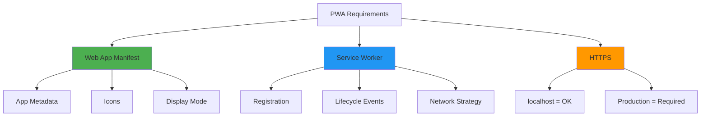

# 📱 PWA Implementation Plan - Baumster

## 🎯 Goal
Transform Baumster into an installable Progressive Web App (PWA) with a minimal, zero-caching service worker setup.

## 📚 PWA Fundamentals

### What We're Building
A **minimal viable PWA** that focuses on **installability** without any caching complexity:

- ✅ **Installable**: Users can add to home screen like a native app
- ✅ **Standalone UI**: Launches without browser chrome (address bar)
- ✅ **App-like experience**: Custom icon, splash screen, theme colors
- ✅ **Service Worker registered**: Meets PWA requirements
- ❌ **No caching**: All requests go to network (your requirement!)

### The Three Core Components



### Why This Approach?

**Your Concern**: "I fear that some stuff will be cached too long"

**Our Solution**: 
1. Service worker that **doesn't cache anything**
2. All requests always hit the network
3. Easy to add caching strategies later when you understand them better

**Benefits**:
- ✅ No stale content issues
- ✅ Changes appear immediately
- ✅ Simple to understand and maintain
- ✅ Future-proof (can add caching later)

---

## 🗺️ Implementation Steps

### Step 1: Create App Icons

**What You Need:**
PWAs require icons in multiple sizes for different contexts:

| Size | Purpose | Required? |
|------|---------|-----------|
| 192x192 | Home screen icon | ✅ Yes |
|512x512 | Splash screen | ✅ Yes |
| 180x180 | iOS devices | Recommended |
| 96x96 | Small icons | Optional |

**File Structure:**
```
public/
├── icons/
│   ├── icon-192x192.png
│   ├── icon-512x512.png
│   └── apple-touch-icon.png (180x180)
```

**Design Guidelines:**
- Use simple, recognizable designs (works at small sizes)
- Square images with transparent or solid backgrounds
- High contrast for visibility
- Your Baumster tree emoji 🌳 or custom logo

**Tools for Icon Creation:**
- [Favicon.io](https://favicon.io/) - Generate from text/image
- [RealFaviconGenerator](https://realfavicongenerator.net/) - Complete icon package
- Photoshop/GIMP/Figma - Manual creation

---

### Step 2: Create Web App Manifest

**File**: `public/manifest.json`

**Purpose**: Tells the browser how to present your app when installed.

**Our Configuration:**
```json
{
  "name": "Baumster - QR Music Player",
  "short_name": "Baumster",
  "description": "Scan QR codes to play Spotify songs instantly",
  "start_url": "/",
  "scope": "/",
  "display": "standalone",
  "orientation": "portrait-primary",
  "theme_color": "#1DB954",
  "background_color": "#191414",
  "icons": [
    {
      "src": "/icons/icon-192x192.png",
      "sizes": "192x192",
      "type": "image/png",
      "purpose": "any maskable"
    },
    {
      "src": "/icons/icon-512x512.png",
      "sizes": "512x512",
      "type": "image/png",
      "purpose": "any maskable"
    }
  ]
}
```

**Key Properties Explained:**

- **`name`**: Full app name shown during installation
- **`short_name`**: Name under the icon (12 chars max recommended)
- **`start_url`**: Where the app opens (`"/"` = root, will load `index.html`)
- **`scope`**: Which URLs belong to this app (`"/"` = entire domain)
- **`display`**: How the app appears:
  - `"standalone"` - No browser UI (what we want!)
  - `"fullscreen"` - No browser UI + no OS UI
  - `"minimal-ui"` - Minimal browser controls
  - `"browser"` - Normal browser experience
- **`theme_color`**: Browser chrome color (we use Spotify green)
- **`background_color`**: Splash screen background (Spotify black)
- **`orientation`**: Lock orientation (mobile-first design)

**Deployment Considerations** (for later):
When you deploy, you may need to update:
- `start_url`: e.g., `"/baumster/"` for subdirectory hosting
- `scope`: e.g., `"/baumster/"` to match start_url

---

### Step 3: Create Minimal Service Worker

**File**: `public/sw.js`

**Purpose**: Satisfies PWA requirements without caching anything.

**Implementation Strategy**: Network-First (No Cache)

```javascript
// Minimal service worker - no caching strategy
// All requests go directly to the network

const CACHE_NAME = 'baumster-v1';

// Install event - just skip waiting, don't cache anything
self.addEventListener('install', (event) => {
  console.log('[Service Worker] Install event');
  // Skip waiting to activate immediately
  self.skipWaiting();
});

// Activate event - clean up old caches if any
self.addEventListener('activate', (event) => {
  console.log('[Service Worker] Activate event');
  event.waitUntil(
    caches.keys().then((cacheNames) => {
      return Promise.all(
        cacheNames.map((cacheName) => {
          // Delete any old caches
          return caches.delete(cacheName);
        })
      );
    })
  );
  // Take control of all clients immediately
  return self.clients.claim();
});

// Fetch event - pass everything through to network
self.addEventListener('fetch', (event) => {
  // Simply pass all requests to the network
  // No caching, no offline support, no interception
  event.respondWith(fetch(event.request));
});
```

**What This Does:**
1. ✅ Registers successfully (PWA requirement met)
2. ✅ Intercepts fetch requests (required for service worker)
3. ✅ Passes everything to network (your no-caching requirement)
4. ✅ Deletes any existing caches on activation
5. ❌ No offline capability (by design)

**Why This Approach:**
- Simplest possible service worker
- Zero caching = zero stale content issues
- Easy to understand and debug
- Foundation for adding caching later

---

### Step 4: Update HTML Files

**Files to Update:**
- `index.html`
- `login.html`
- `scanner.html`
- `playlists.html`

**Changes Needed in `<head>` section:**

```html
<!-- Web App Manifest -->
<link rel="manifest" href="/manifest.json">

<!-- Theme color (browser chrome) -->
<meta name="theme-color" content="#1DB954">

<!-- Apple-specific meta tags -->
<meta name="apple-mobile-web-app-capable" content="yes">
<meta name="apple-mobile-web-app-status-bar-style" content="black-translucent">
<meta name="apple-mobile-web-app-title" content="Baumster">
<link rel="apple-touch-icon" href="/icons/apple-touch-icon.png">
```

**Service Worker Registration** (in respective `.ts` files):

Create a new file: `src/pwa.ts`
```typescript
// Service Worker registration
export function registerServiceWorker(): void {
  if ('serviceWorker' in navigator) {
    window.addEventListener('load', () => {
      navigator.serviceWorker
        .register('/sw.js')
        .then((registration) => {
          console.log('✅ Service Worker registered:', registration.scope);
        })
        .catch((error) => {
          console.error('❌ Service Worker registration failed:', error);
        });
    });
  } else {
    console.log('⚠️ Service Workers not supported in this browser');
  }
}
```

Import and call in each page's main TypeScript file:
```typescript
import { registerServiceWorker } from './pwa';

// At the end of the file
registerServiceWorker();
```

---

### Step 5: Configure Vite

**Update**: `vite.config.ts`

**Goal**: Ensure PWA files are included in build output.

**Current Vite Setup:**
- Already copying files from `public/` folder ✅
- No additional configuration needed for basic PWA

**For Production Build:**
```typescript
import { defineConfig } from 'vite';

export default defineConfig({
    server: {
        host: '127.0.0.1',
        port: 5173,
    },
    build: {
        rollupOptions: {
            input: {
                main: './index.html',
                login: './login.html',
                scanner: './scanner.html',
                playlists: './playlists.html',
            },
        },
        // Ensure service worker is copied
        copyPublicDir: true,
    },
});
```

**What Happens During Build:**
- `public/manifest.json` → `dist/manifest.json`
- `public/sw.js` → `dist/sw.js`
- `public/icons/*` → `dist/icons/*`

---

### Step 6: Testing & Validation

**Testing Environment:**
- Chrome/Edge: Best PWA support and DevTools
- Firefox: Good support but different install UI
- Safari: Limited support but improving

**Testing Checklist:**

#### 1. Manifest Detection
Open Chrome DevTools → Application → Manifest

**Check for:**
- ✅ Manifest loads without errors
- ✅ All icons are accessible
- ✅ App name displays correctly
- ✅ Install button appears in address bar

#### 2. Service Worker Registration
Open Chrome DevTools → Application → Service Workers

**Check for:**
- ✅ Service worker registered at `/sw.js`
- ✅ Status shows "activated and running"
- ✅ No errors in console
- ✅ Fetch events are intercepted

#### 3. Install Test
Click the install button in Chrome's address bar

**Verify:**
- ✅ Installation prompt appears
- ✅ App name and icon show correctly
- ✅ After install, app opens in standalone window
- ✅ No address bar visible
- ✅ App appears in OS app launcher

#### 4. Network Behavior
Open DevTools → Network tab

**Verify:**
- ✅ All requests go to network (not cache)
- ✅ Hard refresh shows all resources load
- ✅ No "from ServiceWorker" in Size column

---

## 🔬 Chrome DevTools PWA Audit

**Built-in Testing Tool:**
1. Open DevTools → Lighthouse tab
2. Select "Progressive Web App" category
3. Click "Analyze page load"

**Expected Results (Minimal PWA):**
- ✅ Installable (meets criteria)
- ✅ Has a service worker
- ✅ Has a web app manifest
- ✅ Configured for standalone display
- ⚠️ Does not work offline (by design)
- ⚠️ No splash screen (needs icons)

---

## 🚀 Future Enhancements

Once you're comfortable with the basic PWA setup, here are caching strategies to explore:

### 1. Cache-First Strategy
**Use For**: Static assets (CSS, JS, images)
```javascript
// Cache static assets, fallback to network
event.respondWith(
  caches.match(event.request).then((response) => {
    return response || fetch(event.request);
  })
);
```

### 2. Network-First Strategy
**Use For**: API requests, dynamic content
```javascript
// Try network first, fallback to cache
event.respondWith(
  fetch(event.request)
    .then((response) => {
      // Clone and cache successful responses
      const responseClone = response.clone();
      caches.open(CACHE_NAME).then((cache) => {
        cache.put(event.request, responseClone);
      });
      return response;
    })
    .catch(() => {
      // Network failed, try cache
      return caches.match(event.request);
    })
);
```

### 3. Stale-While-Revalidate
**Use For**: Balance between fresh and fast
```javascript
// Return cached version immediately, update in background
event.respondWith(
  caches.open(CACHE_NAME).then((cache) => {
    return cache.match(event.request).then((cachedResponse) => {
      const fetchPromise = fetch(event.request).then((networkResponse) => {
        cache.put(event.request, networkResponse.clone());
        return networkResponse;
      });
      return cachedResponse || fetchPromise;
    });
  })
);
```

### 4. Cache Versioning
**Problem**: How to update cached files?
**Solution**: Version your cache name
```javascript
const CACHE_VERSION = 'v2'; // Increment when you update
const CACHE_NAME = `baumster-${CACHE_VERSION}`;

// In activate event, delete old versions
self.addEventListener('activate', (event) => {
  event.waitUntil(
    caches.keys().then((cacheNames) => {
      return Promise.all(
        cacheNames
          .filter((name) => name !== CACHE_NAME)
          .map((name) => caches.delete(name))
      );
    })
  );
});
```

---

## 📚 Learning Resources

### Official Documentation
- [MDN: Progressive Web Apps](https://developer.mozilla.org/en-US/docs/Web/Progressive_web_apps)
- [web.dev: Progressive Web Apps](https://web.dev/progressive-web-apps/)
- [Google: Service Workers](https://developers.google.com/web/fundamentals/primers/service-workers)

### PWA Tools
- [Lighthouse PWA Audit](https://developers.google.com/web/tools/lighthouse)
- [PWA Builder](https://www.pwabuilder.com/) - Generate PWA assets
- [Workbox](https://developers.google.com/web/tools/workbox) - Production-ready service workers

### Testing
- Chrome DevTools Application Panel
- [Lighthouse CI](https://github.com/GoogleChrome/lighthouse-ci) - Automated testing
- [PWA Testing Checklist](https://web.dev/pwa-checklist/)

---

## 🐛 Common Issues & Solutions

### Issue: Install button doesn't appear
**Causes:**
- Manifest not linked in HTML
- Service worker not registered
- Not serving over HTTPS (production)
- Missing required manifest properties

**Debug:**
1. Check DevTools → Application → Manifest for errors
2. Verify service worker in Application → Service Workers
3. Run Lighthouse PWA audit
4. Check browser console for errors

### Issue: Service worker not updating
**Causes:**
- Browser caching old service worker
- Not calling `skipWaiting()` in install event

**Solution:**
```javascript
self.addEventListener('install', (event) => {
  self.skipWaiting(); // Force immediate activation
});

self.addEventListener('activate', (event) => {
  return self.clients.claim(); // Take control immediately
});
```

### Issue: App installs but doesn't work offline
**This is expected!** Our minimal service worker doesn't cache anything.

**To add offline support later:**
- Implement cache-first or network-first strategies
- Pre-cache critical assets in install event
- Handle offline scenarios with fallback pages

### Issue: Changes don't appear after install
**With our setup:** This shouldn't happen (no caching!)

**If it does:**
1. Uninstall the app
2. Clear browser cache (DevTools → Application → Clear storage)
3. Re-register service worker
4. Reinstall

---

## ✅ Success Criteria

Your PWA implementation is successful when:

- [ ] Manifest loads without errors
- [ ] All icons display correctly
- [ ] Service worker registers and activates
- [ ] Install button appears in browser
- [ ] App installs to home screen/desktop
- [ ] Installed app opens in standalone mode (no browser UI)
- [ ] App icon shows in OS app launcher
- [ ] All network requests go to network (no caching)
- [ ] Lighthouse PWA audit shows "Installable"
- [ ] Works on mobile and desktop browsers

---

## 📝 Next Steps After Implementation

1. **Test Installation Flow**
   - Install on mobile device
   - Install on desktop
   - Verify standalone display mode

2. **Consider Caching Strategy**
   - Once comfortable, explore cache-first for static assets
   - Read about cache versioning
   - Test offline scenarios

3. **Deployment**
   - Update `start_url` and `scope` for production URL
   - Ensure HTTPS certificate
   - Test on production domain

4. **Enhancements**
   - Add app shortcuts (quick actions)
   - Implement push notifications
   - Add offline fallback page
   - Create richer splash screens

---

## 🎯 Summary

**What You're Building:**
A minimal, installable PWA with zero caching complexity.

**Key Files:**
- `public/manifest.json` - App metadata
- `public/sw.js` - Minimal service worker (no caching)
- `public/icons/*` - App icons
- `src/pwa.ts` - Service worker registration

**Philosophy:**
Start simple, learn by doing, add complexity only when needed.

**Your Advantage:**
By starting without caching, you'll understand PWA fundamentals without fighting cache invalidation issues. Once comfortable, adding intelligent caching will be straightforward.

Ready to implement? Let's proceed step by step! 🚀