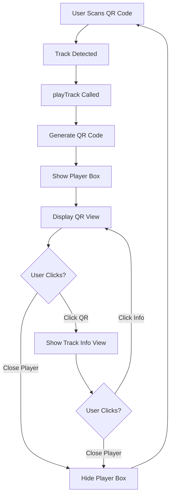
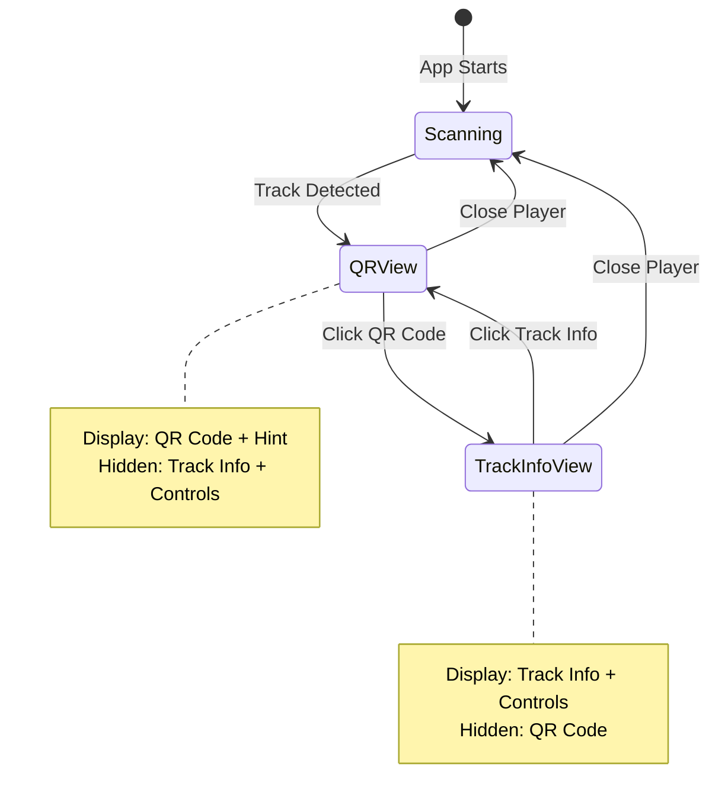

# QR Code Toggle Feature - Implementation Plan

## Overview
Modify the scanner page to show only a generated QR code when a track starts playing. Clicking the QR code reveals the full track information, controls, and progress bar. Users can toggle back and forth between the two views.

## Current State Analysis

### Current Behavior
- When a track is scanned and starts playing, the player box immediately displays:
  - Track image and details
  - Player controls (play/pause, prev, next)
  - Progress bar and time display

### Desired Behavior
1. **Initial View (QR Only)**:
   - Show generated QR code containing the Spotify track URL
   - Hide track info, controls, and progress bar
   - QR code is clickable

2. **Expanded View (Full Info)**:
   - Show track info (image, name, artist)
   - Show player controls
   - Show progress bar and time
   - Track info is clickable

3. **Toggle Interaction**:
   - Click QR → Show full track info
   - Click track info → Show QR code
   - Seamless toggling between views

## Implementation Steps

### 1. HTML Structure Changes

File: [`scanner.html`](scanner.html:25)

The player box needs to be restructured to have two separate views:
- QR View: Contains only the QR code image and a hint
- Track Info View: Contains all the existing player elements

Key changes:
- Wrap track info, controls, and progress in a container
- Add new QR view container
- Add hint text for both views
- Make both views clickable for toggling

### 2. CSS Changes

File: [`src/style.css`](src/style.css:387)

New styles needed:
- `.qr-view` - Container for QR code display
- `.qr-code-image` - Styling for the QR code image
- `.qr-hint` - Hint text below QR code
- `.track-info-view` - Container for existing player elements
- `.info-hint` - Hint text in expanded view
- Hover effects for clickable areas
- Responsive styles for mobile devices

### 3. TypeScript Changes

File: [`src/scanner.ts`](src/scanner.ts:1)

#### New Imports
Add QRCode library import at the top of the file

#### New State Variables
- `isShowingQrCode` - Boolean to track current view
- `currentTrackUrl` - Store the Spotify URL for QR generation

#### New Functions to Add

**generateTrackQrCode(trackUri: string)**
- Converts Spotify URI to URL format
- Generates QR code using QRCode library
- Returns data URL for image src

**showQrView()**
- Displays QR view
- Hides track info view
- Updates state flag

**showTrackInfoView()**
- Hides QR view
- Displays track info view
- Updates state flag

**toggleView()**
- Checks current state
- Calls appropriate show function

**setupViewToggle()**
- Attaches click handlers to both views
- Enables toggling between views

#### Functions to Modify

**playTrack(trackUri: string)**
- Store trackUri in global variable
- Generate and display QR code
- Call showPlayerBox

**showPlayerBox()**
- Display player box
- Generate QR code if track URI exists
- Set QR image src
- Ensure QR view is visible

**init()**
- Add call to setupViewToggle

## Technical Specifications

### QR Code Generation
- **Library**: `qrcode` npm package
- **Format**: Data URL (base64 encoded PNG)
- **Size**: 400px width for high quality
- **Error Correction**: Level H (High) - 30% recovery
- **Margin**: 2 modules

### URL Format
- **Pattern**: `https://open.spotify.com/track/{track_id}`
- **Source**: Extract ID from `spotify:track:{track_id}` URI
- **Example**: `https://open.spotify.com/track/3n3Ppam7vgaVa1iaRUc9Lp`

### View States
- **Default**: QR view visible, track info hidden
- **After Click**: Track info visible, QR view hidden
- **Toggle**: Click handler swaps visibility

### Styling Approach
- **Display Control**: `style.display` property
- **QR View**: `display: flex` (visible) / `display: none` (hidden)
- **Track Info View**: `display: block` (visible) / `display: none` (hidden)
- **Transitions**: Smooth hover effects on both views

## User Experience Design

### Visual Hierarchy
1. **Player Header**: Always visible with title and close button
2. **Main Content**: Either QR view or track info view
3. **Hint Text**: Subtle guidance for interaction

### Interaction Patterns
- **Hover Feedback**: Scale transform on hover
- **Click Areas**: Entire view containers are clickable
- **Visual Hints**: Text prompts guide users
- **Smooth Transitions**: CSS transitions for polish

### Accessibility
- **Alt Text**: QR code image has descriptive alt text
- **Cursor**: Pointer cursor indicates clickability
- **Contrast**: Hint text uses sufficient contrast
- **Focus States**: Maintain keyboard navigation

## Testing Strategy

### Functional Tests
- [ ] QR code generates correctly from track URI
- [ ] QR code is scannable with phone camera
- [ ] QR code links to correct Spotify track
- [ ] Clicking QR shows track info view
- [ ] Clicking track info shows QR view
- [ ] Multiple toggles work correctly
- [ ] Player controls function in expanded view
- [ ] Progress bar updates in expanded view

### Integration Tests
- [ ] Scanner continues working after player opens
- [ ] Close button works in both views
- [ ] New scans generate new QR codes
- [ ] State resets properly between tracks

### Responsive Tests
- [ ] QR code scales on mobile devices
- [ ] Layout remains functional on small screens
- [ ] Touch interactions work correctly
- [ ] Text remains readable on all sizes

### Edge Cases
- [ ] QR generation fails gracefully
- [ ] Missing track information handled
- [ ] Rapid toggle clicks handled
- [ ] Player state changes during toggle

## Files to Modify

1. **scanner.html** (Lines 25-53)
   - Restructure player box HTML
   - Add QR view container
   - Wrap existing content in track info view

2. **src/style.css** (After line 586)
   - Add QR view styles
   - Add track info view styles
   - Add hint text styles
   - Add responsive media queries

3. **src/scanner.ts** (Multiple locations)
   - Add QRCode import (line 3)
   - Add state variables (after line 15)
   - Add new functions (after line 233)
   - Modify existing functions (lines 126, 203, 403)

## Dependencies

### Already Available
- ✅ `qrcode` package - Used in [`src/pdf-generator.ts`](src/pdf-generator.ts:2)
- ✅ `html5-qrcode` - Used for scanning
- ✅ Spotify Web Playback SDK - Already integrated

### No New Dependencies Required
All required packages are already in the project.

## Implementation Flow Diagram

## State Management

## Expected Outcome

After successful implementation:

1. **Initial Display**
   - User scans a Spotify QR code
   - Player box appears showing only the generated QR code
   - Hint text: "Click to see track info"

2. **Interaction Flow**
   - User clicks QR code image
   - View transitions to full track information
   - Player controls and progress bar become visible
   - Hint text: "Click to see QR code"

3. **Toggle Capability**
   - User can click back to QR view anytime
   - State persists during playback
   - New scans reset to QR view

4. **Benefits**
   - Share currently playing track via QR
   - Clean initial display
   - Full control when needed
   - Intuitive interaction pattern

## Success Criteria

- ✅ QR code displays immediately when track plays
- ✅ QR code is scannable and opens correct Spotify track
- ✅ Click interaction toggles between views
- ✅ All player controls work in expanded view
- ✅ Progress bar updates correctly
- ✅ Responsive on mobile and desktop
- ✅ No breaking changes to existing functionality
- ✅ Clean, intuitive user experience